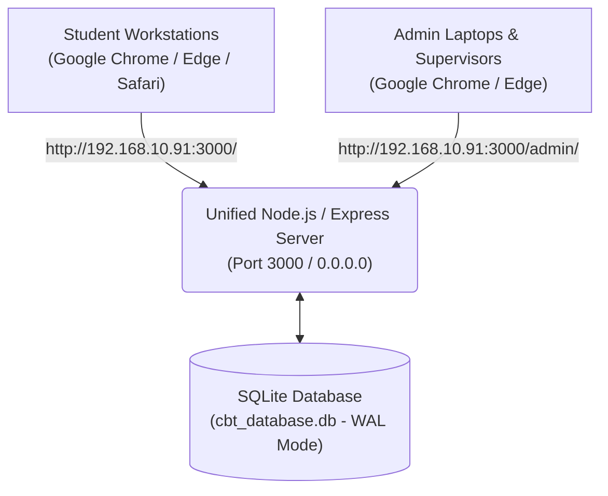

# Anthony White Bridge Academy — Zero-Installation Local Network Web CBT System

[](https://google.com/chrome)
[](https://nodejs.org)
[](https://react.dev)
[](https://flutter.dev)

A secure, high-performance, offline local-area-network (LAN) Computer-Based Testing (CBT) platform engineered specifically for **Anthony White Bridge Academy**. Designed to conduct zero-latency objective examinations across school computer laboratories and mobile Wi-Fi workstations without requiring an active internet connection or any client-side desktop software installation.

---

## 🏛️ Brand Identity & Design System

The platform strictly adheres to the official **Anthony White Bridge Academy** brand identity:
- **Primary Brand Color:** `#F96302` Orange
- **Design Aesthetic:** High-contrast corporate executive layout, crisp slate cards, and child-friendly JSS 1 student interfaces.
- **Logo Integration:** Official school crest asset (`school_logo.jpg`) integrated across the Student Web Application and Admin Control Center.

---

## 🏗️ System Architecture Overview

The system runs under a **Unified Single-Port Node.js/Express Server** (`Port 3000`) bound to network interface `0.0.0.0` for local Wi-Fi / Ethernet access:

```
Desktop CBT App/
├── backend/            # Express REST API, SQLite WAL Database & Static Multi-App Server
│   └── public/         # Compiled Production Assets (Student Client & Admin Dashboard)
├── admin-dashboard/    # Executive Admin Control Center (React 19 + Vite + Tailwind CSS)
└── student_client/     # Student Examination Web Application (Flutter Web)
```



### Subsystem Breakdown

1. **Student Web Application (`/`)**
   - Accessed at `http://<SERVER_IP>:3000/` via Google Chrome or any modern browser.
   - Built with **Flutter Web** (compiled into static SPA bundle hosted by Express).
   - Features 60-minute countdown timer, quick-jump question grid, dual-storage failover, silent background autosaving, timestamp-based timer persistence across page refreshes (`F5`), and zero-score candidate privacy.

2. **Admin Control Center (`/admin/`)**
   - Accessed at `http://<SERVER_IP>:3000/admin/` via Google Chrome.
   - Built with **React 19**, **Vite** (`base: '/admin/'`), and **Tailwind CSS**.
   - Features class-scoped question bank hub (**JSS 1 through SS 3**), MS Word (`.docx`) and Excel question parser with answer key extraction, Excel roster bulk upload, real-time candidate session monitoring, and `.xlsx` score sheet exports.

3. **Unified Backend API Server (`/api/*`)**
   - Built with **Node.js**, **Express**, and **SQLite3** running in Write-Ahead Logging (**WAL**) mode with a 10,000ms busy timeout for high-concurrency (90+ workstations).
   - Handles student verification, randomized question paper distribution, background answer autosaving, automated server-side grading, and session locking (`is_locked = 1`).

---

## ⭐ Core Features

### 🚀 1. Zero-Installation Client Deployment
- Eliminates USB flash drives and desktop software installation on student laptops.
- Students simply connect their laptop/tablet to the school network Wi-Fi, open Google Chrome, and type `http://192.168.10.91:3000`.

### 🔐 2. Robust Student Authentication & Case-Insensitive Login
- Students log in using their 7-digit Registration Number (e.g. `1009001`) and Surname.
- Backend authentication handles surname formatting variations safely (`TRIM(UPPER(surname)) = TRIM(UPPER(?))`), matching `"OBI"`, `"Obi"`, `"obi"`, or `" Obi "` without false "Check Your Details" errors.

### 📄 3. Class-Scoped Question Bank & Answer Key Parser
- Dedicated Question Bank Hub with class tabs for **JSS 1, JSS 2, JSS 3, SS 1, SS 2, and SS 3**.
- Upload question documents along with answer keys in MS Word (`.docx`), Excel (`.xlsx`/`.csv`), or text format. Automatically extracts question stems, options A–D, and correct options into SQLite.

### 🔄 4. Refresh State Recovery (`F5`) & Timer Persistence
- Uses timestamp-based countdown tracking (`endTimestamp`) stored in local storage and synchronized with the backend.
- If a student accidentally reloads or refreshes their browser page, the 60-minute countdown clock and all answered questions are restored without timer resets or data loss.

### 🙈 5. Strict Score Privacy Rule
- Scores are computed exclusively server-side and **never** returned in student API responses or displayed on client screens.
- Candidates see a clean completion confirmation screen:
  > *"Exam Submitted Successfully! Thank you, Anthony White Bridge Academy student. Please raise your hand and wait quietly for your supervisor."*

---

## 💻 Server Setup & Execution Guide

### Prerequisites
On the primary server laptop:
- **Node.js** (v18.x or higher)
- **npm** (v9.x or higher)
- **Flutter SDK** (v3.22.x or higher with Web enabled)

---

### Step-by-Step Deployment Commands

#### 1. Build & Sync Production Web Assets
To compile and bundle both the Student Client and Admin Dashboard into the backend server:

```powershell
# Step A: Build Student Web Client
cd "c:\Users\ESCANOR\Downloads\Desktop CBT App\student_client"
flutter config --enable-web
flutter build web

# Step B: Build Admin Dashboard
cd "c:\Users\ESCANOR\Downloads\Desktop CBT App\admin-dashboard"
npm run build

# Step C: Sync All Builds to Backend Public Folder
cd "c:\Users\ESCANOR\Downloads\Desktop CBT App\backend"
npm run sync-all
```

#### 2. Start the Server
Inside the `backend` directory, launch the Express server:

```powershell
cd "c:\Users\ESCANOR\Downloads\Desktop CBT App\backend"
npm start
```

Console output will confirm:
```text
====================================================
🚀 CBT Server running locally on http://localhost:3000
🌐 LAN Network Student App: http://0.0.0.0:3000/
🛡️ LAN Network Admin Dashboard: http://0.0.0.0:3000/admin/
🏥 Health Check API: http://localhost:3000/api/health
====================================================
```

---

## ⚡ Critical Network & Firewall Prerequisites

To ensure student laptops and workstations on the school Wi-Fi/LAN can connect to the server without connection timeouts or blocked requests, configure the following on the primary server laptop:

### 1. Configure Windows Defender Firewall (Allow Port 3000 & Node.exe)

By default, Windows Firewall may block incoming connections from external Wi-Fi clients.

#### Quick Automated Firewall Rule (Run as Administrator in PowerShell):
```powershell
New-NetFirewallRule -DisplayName "CBT Express Server (Port 3000)" -Direction Inbound -LocalPort 3000 -Protocol TCP -Action Allow -Profile Private,Public
```

#### Manual Firewall Configuration:
1. Press `Win + R`, type `wf.msc`, and press **Enter** to open **Windows Defender Firewall with Advanced Security**.
2. Click **Inbound Rules** in the left panel, then click **New Rule...** on the right.
3. Select **Port** -> Click **Next**.
4. Select **TCP**, enter `3000` in **Specific local ports** -> Click **Next**.
5. Select **Allow the connection** -> Click **Next**.
6. Check all profiles (**Domain**, **Private**, **Public**) -> Click **Next**.
7. Name the rule `CBT Express Server (Port 3000)` -> Click **Finish**.

---

### 2. Antivirus Network Shield Safeguards (Avast / AVG / Kaspersky / Defender)

If third-party antivirus software (e.g., Avast, AVG, Bitdefender) is installed on the server laptop:
1. Open your Antivirus control panel.
2. Navigate to **Protection** -> **Firewall** / **Web Shield** settings.
3. Add an exception for **Node.js (`node.exe`)** or allow local network IPv4 traffic (`192.168.x.x`).
4. Ensure the local network connection profile is set to **Private / Trusted Network**.

---

### 3. Identify Server IPv4 Address

1. Open Command Prompt (`cmd`) or PowerShell on the server laptop.
2. Type `ipconfig` and press **Enter**.
3. Locate the **IPv4 Address** under your active Wi-Fi or Ethernet adapter (e.g., `192.168.10.91`).

---

## 📱 Student Workstation Connection Guide

No software installation or setup is required on student laptops or computer lab workstations!

1. Connect the student laptop to the school Wi-Fi or LAN network switch.
2. Open **Google Chrome** (or Microsoft Edge / Safari / Firefox).
3. In the address bar, type the server IP address:
   ```text
   http://192.168.10.91:3000
   ```
4. Enter Registration Number (e.g., `1009001`) and Surname (e.g., `OKONKWO`).
5. Click **START EXAM**.

---

## 📡 API Endpoint Reference

| Method | Endpoint | Description |
| :--- | :--- | :--- |
| `POST` | `/api/login` | Authenticate student & initialize/resume active session |
| `GET` | `/api/subjects` | Fetch dynamic list of available exam subjects |
| `GET` | `/api/student/:id/dashboard` | Fetch student profile & per-subject completion statuses |
| `GET` | `/api/exam/questions/:subject` | Fetch randomized question paper for subject |
| `POST` | `/api/exam/autosave` | Silent background autosave of selected choice |
| `POST` | `/api/exam/submit` | Submit exam paper & compute score in SQLite |
| `GET` | `/api/admin/overview` | Summary statistics for Admin Dashboard |
| `GET` | `/api/admin/students` | Fetch registered student candidates |
| `POST` | `/api/admin/students` | Register candidate (saved permanently to SQLite) |
| `POST` | `/api/admin/upload-roster` | Bulk upload student roster from Excel (`.xlsx`) |
| `POST` | `/api/admin/upload-questions` | Upload & parse MS Word (`.docx`) test paper & answer keys |
| `GET` | `/api/admin/results` | Fetch live results & active workstation statuses |
| `GET` | `/api/admin/export-excel` | Stream `.xlsx` Excel spreadsheet of exam results |

---

## 🐙 Git Cleanliness & Push Instructions

To stage all project updates, verify `.gitignore` hygiene, and push the repository to GitHub:

```bash
# Step 1: Check status to ensure node_modules and temp files are ignored
git status

# Step 2: Stage all updated files
git add .

# Step 3: Commit updates
git commit -m "feat: complete zero-installation web CBT system with unified Express static server, WAL SQLite mode, and docs"

# Step 4: Push to GitHub repository
git push origin main
```

---

## 🏫 Credits & Copyright

Developed for **Anthony White Bridge Academy**.  
© 2026 Anthony White Bridge Academy — All Rights Reserved.
