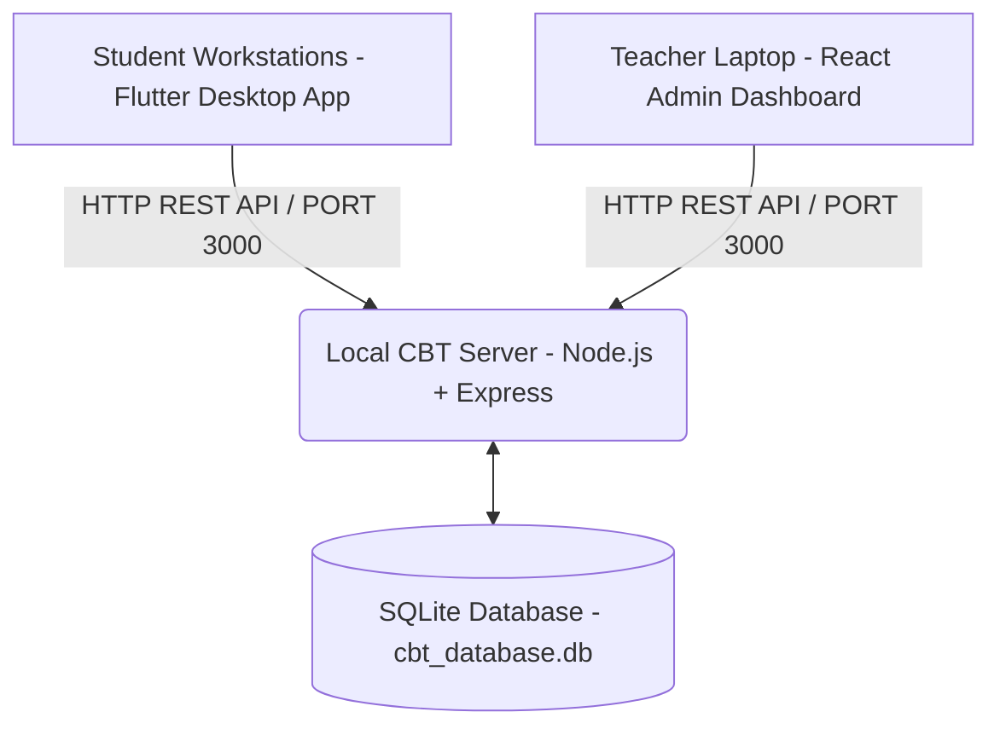

# Anthony White Bridge Academy — Offline Desktop CBT Platform

[](https://flutter.dev)
[](https://nodejs.org)
[](https://react.dev)
[](https://flutter.dev)

A secure, high-performance, offline local-area-network (LAN) Computer-Based Testing (CBT) platform engineered specifically for **Anthony White Bridge Academy**. Designed to conduct zero-latency objective examinations across school computer laboratories without requiring an active internet connection.

---

## 🏛️ Brand Identity & Design System

The platform strictly adheres to the official **Anthony White Bridge Academy** brand identity:
- **Primary Brand Color:** `#F96302` Orange
- **Design Aesthetic:** High-contrast corporate executive layout, crisp white/dark cards, slate borders, and child-friendly JSS 1 student interfaces.
- **Logo Integration:** School crest asset (`school_logo.jpg`) integrated across the Student Desktop App and Admin Control Center.

---

## 🏗️ System Architecture

The application is structured into three decoupled, modular subsystems:

```
Desktop CBT App/
├── backend/            # Offline Node.js + Express REST API & SQLite Database Engine
├── admin-dashboard/    # Executive Control Center built with React & Tailwind CSS
└── student_client/     # High-performance Desktop Examination Client built in Flutter
```



### Subsystem Breakdown

1. **Local Backend Server (`/backend`)**
   - Built with **Node.js**, **Express**, and **SQLite3**.
   - Manages student verification, randomized test paper distribution, background answer autosaving, auto-grading, and session locking.
   - Provides streaming `.xlsx` Excel result export generation via `exceljs`.

2. **Admin Control Center (`/admin-dashboard`)**
   - Built with **React 19**, **Vite**, and **Tailwind CSS**.
   - Features real-time workstation monitoring, MS Word (`.docx`) question paper uploading and parsing (powered by `mammoth`), student roster management, and live score analytics.

3. **Student Examination Desktop App (`/student_client`)**
   - Built with **Flutter Desktop** (Dart).
   - Features a split-screen layout with 60-minute countdown timer, quick-jump question grid (1 to 50), dual local disk caching (`SharedPreferences`) for power-fault recovery, silent background autosaving, child-friendly error popups, and secure score hiding.

---

## ⭐ Key Features

### 🔐 1. Authentication & Dual-Desk Session Locking
- **Credentials:** Students log in using their unique 7-digit Registration Number (e.g. `1009001`) and ALL-CAPS Surname (e.g. `OKONKWO`).
- **Session Locking (`is_locked`):** Prevents concurrent logins from multiple workstations. Once a student submits their paper, their session is permanently locked (`is_locked = 1`).

### 📄 2. Automated Word Document (.docx) Question Parser
- Teachers can upload standard MS Word test papers containing questions, options A–D, and correct answer keys.
- Automatically parses and imports questions into the SQLite database for any subject (Mathematics, English Language, Physics, Chemistry, etc.).

### ⏱️ 3. 60-Minute Timer & Auto-Submit Routine
- Prominent countdown timer starting at 60:00.
- Visual warning badge (blinking red) triggers when under 5 minutes remain.
- When the timer reaches 00:00, the system automatically finalizes and submits answers without requiring student interaction.

### 💾 4. Local Caching & Background Auto-Save
- Selecting any option saves instantly to local disk storage (`SharedPreferences`). If a workstation suddenly loses power, progress is restored upon logging back in.
- Simultaneously sends a background `POST /api/exam/autosave` request to update the SQLite database silently.

### 🙈 5. Secure Score Hiding & Child-Friendly UX
- In accordance with school policy, scores are calculated strictly server-side and **never** exposed to the student client.
- Displays a clear, child-friendly completion screen suited for JSS 1 students:
  > *"Exam Submitted Successfully! Thank you, Anthony White Bridge Academy student. Please raise your hand and wait quietly for your supervisor."*
- Features an automatic 15-second timer or manual supervisor button (*"RETURN TO LOGIN FOR NEXT STUDENT"*) to reset the app completely for the next student.

### 📊 6. Real-Time Monitoring & One-Click Excel Export
- Admin Dashboard provides 5-second live polling of active student sessions.
- Generates and downloads formatted MS Excel (`.xlsx`) score sheets detailing student reg numbers, surnames, classes, subjects, workstation IPs, scores (/50), and submission timestamps.

---

## 🚀 Local Deployment & Setup Instructions

### Prerequisites
Ensure the primary server machine and workstations have:
- **Node.js** (v18.x or higher)
- **npm** (v9.x or higher)
- **Flutter SDK** (v3.22.x or higher with Desktop enabled)

---

### Step 1: Start the Local Node.js Server (`backend`)

1. Navigate to the backend directory:
   ```bash
   cd backend
   ```
2. Install dependencies:
   ```bash
   npm install
   ```
3. Initialize SQLite database schema and seed mock data:
   ```bash
   node database.js
   ```
4. Start the server (default port `3000`):
   ```bash
   npm start
   ```
   *The backend is now listening at `http://localhost:3000` or `http://<SERVER_IP>:3000`.*

---

### Step 2: Launch the Admin Control Center (`admin-dashboard`)

1. Open a new terminal and navigate to `admin-dashboard`:
   ```bash
   cd admin-dashboard
   ```
2. Install dependencies:
   ```bash
   npm install
   ```
3. Start the Vite development server:
   ```bash
   npm run dev
   ```
4. Open your browser and navigate to `http://localhost:5173`.

---

### Step 3: Compile & Deploy the Student Desktop Client (`student_client`)

#### Running in Development Mode
1. Navigate to `student_client`:
   ```bash
   cd student_client
   ```
2. Fetch dependencies:
   ```bash
   flutter pub get
   ```
3. Run desktop application:
   ```bash
   flutter run -d windows
   ```

#### Compiling for Flash-Drive LAN Deployment Across Workstations
To deploy the student application across school computer lab workstations without installing Flutter on each machine:

1. Build the production release executable:
   ```bash
   flutter build windows --release
   ```
2. Copy the generated release folder from:
   `student_client/build/windows/x64/runner/Release/`
3. Paste the folder onto a USB Flash Drive and copy it to each student workstation.
4. Double-click `student_client.exe` on each workstation to launch the CBT portal. Ensure the workstation is connected to the server via LAN Wi-Fi or Ethernet cable.

---

## 📡 API Endpoint Summary

| Method | Endpoint | Description |
| :--- | :--- | :--- |
| `POST` | `/api/login` | Authenticate student & initialize/resume session |
| `GET` | `/api/exam/questions/:subject` | Fetch 50 randomized questions for specified subject |
| `POST` | `/api/exam/autosave` | Silent background save of selected option |
| `POST` | `/api/exam/submit` | Final exam submission & session locking (`is_locked = 1`) |
| `GET` | `/api/admin/overview` | Fetch summary statistics for Admin Dashboard |
| `GET` | `/api/admin/students` | Fetch registered student roster |
| `POST` | `/api/admin/students` | Register a new student |
| `POST` | `/api/admin/upload-questions` | Upload & parse MS Word (`.docx`) test paper |
| `GET` | `/api/admin/results` | Fetch live results & active workstation statuses |
| `GET` | `/api/admin/export-excel` | Stream `.xlsx` Excel spreadsheet of all results |

---

## 🏫 Credits & Copyright

Developed for **Anthony White Bridge Academy**.  
© 2026 Anthony White Bridge Academy — All Rights Reserved.
