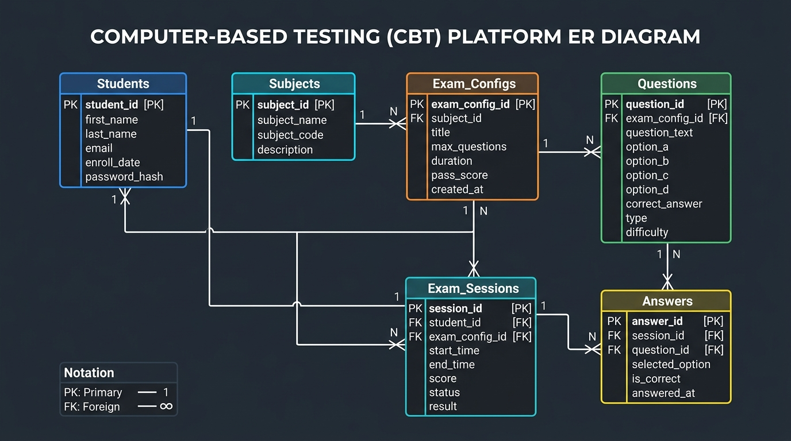
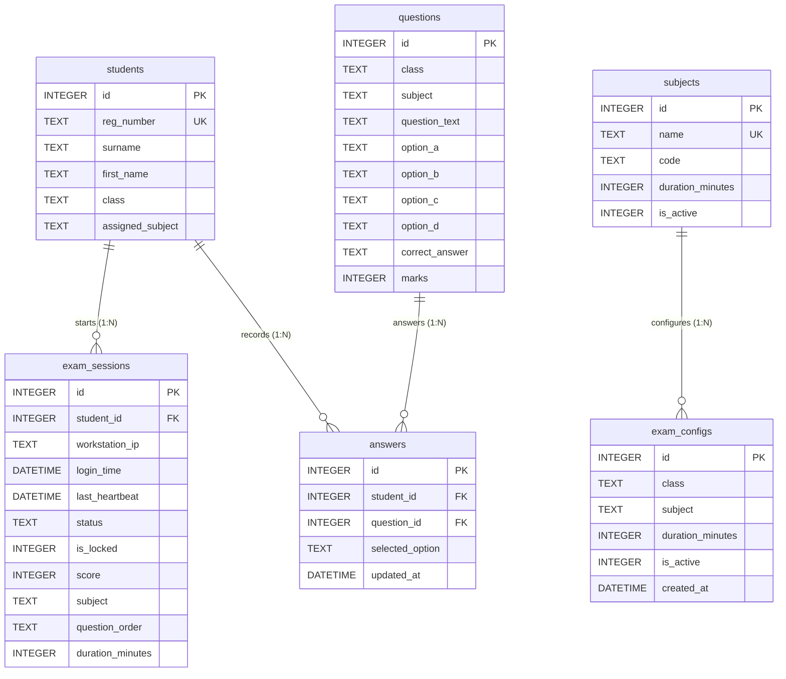

# Anthony White Bridge Academy CBT Platform — Database Architecture & Security Audit

> **Document Version:** 1.0.0  
> **Target System:** Node.js Express + SQLite WAL Backend  
> **Scope:** Schema Inspection, Relationship Topology, API Endpoint Mapping, ER Diagram & Performance Audit  
> **Status:** Complete Architecture Audit  

---

## 1. Executive Summary

This architecture document provides a comprehensive database audit and entity-relationship topology for the **Anthony White Bridge Academy** local-area-network Computer-Based Testing (CBT) platform.

The system utilizes an embedded **SQLite** database configured with **Write-Ahead Logging (WAL)** mode for high-throughput concurrency across 90+ school laboratory workstations.

---

## 2. Complete Entity-Relationship (ER) Diagram

---

## 3. Physical Database Schema Specification

### 3.1 `students` Table
Stores candidate registration details, class arm assignments, and subject enrollments.

| Column | Data Type | Constraints | Description |
|---|---|---|---|
| `id` | `INTEGER` | `PRIMARY KEY AUTOINCREMENT` | Internal unique candidate surrogate key |
| `reg_number` | `TEXT` | `UNIQUE NOT NULL` | School registration number (e.g. `AWBA/2026/1001`) |
| `surname` | `TEXT` | `NOT NULL` | Candidate surname (stored strictly UPPERCASE) |
| `first_name` | `TEXT` | `NOT NULL DEFAULT ''` | Candidate first name |
| `class` | `TEXT` | `NOT NULL` | Class arm stream (e.g. `JSS 1 Gold`, `JSS 1 Silver`, `SS 3 Science`) |
| `assigned_subject` | `TEXT` | `NOT NULL` | Comma-separated list of assigned exam subjects |

* **Existing Indexes:** `idx_students_class` ON `students(class)`

---

### 3.2 `questions` Table
Stores objective multiple-choice question items, option sets, answer keys, and difficulty/marks weights.

| Column | Data Type | Constraints | Description |
|---|---|---|---|
| `id` | `INTEGER` | `PRIMARY KEY AUTOINCREMENT` | Internal unique item surrogate key |
| `class` | `TEXT` | `NULLABLE` | Specific class arm or level scope (`JSS 1`, `SS 1 Science`, etc.) |
| `subject` | `TEXT` | `NOT NULL` | Subject paper name (`Mathematics`, `Physics`, etc.) |
| `question_text` | `TEXT` | `NOT NULL` | Full question stem prompt |
| `option_a` | `TEXT` | `NOT NULL` | Option A choice text |
| `option_b` | `TEXT` | `NOT NULL` | Option B choice text |
| `option_c` | `TEXT` | `NOT NULL` | Option C choice text |
| `option_d` | `TEXT` | `NOT NULL` | Option D choice text |
| `correct_answer` | `TEXT` | `NOT NULL CHECK(IN ('A','B','C','D'))` | Answer key choice |
| `marks` | `INTEGER` | `DEFAULT 1` | Point weight for correct response |

* **Existing Indexes:** `idx_questions_class_subject` ON `questions(class, subject)`

---

### 3.3 `exam_sessions` Table
Manages live student examination state, workstation IP tracking, heartbeats, randomized question sequences, and score persistence.

| Column | Data Type | Constraints | Description |
|---|---|---|---|
| `id` | `INTEGER` | `PRIMARY KEY AUTOINCREMENT` | Session identifier |
| `student_id` | `INTEGER` | `NOT NULL FK(students.id) ON DELETE CASCADE` | Assigned candidate ID |
| `workstation_ip` | `TEXT` | `NOT NULL` | Lab workstation IP address |
| `login_time` | `DATETIME` | `DEFAULT CURRENT_TIMESTAMP` | Initial session start timestamp |
| `last_heartbeat` | `DATETIME` | `DEFAULT CURRENT_TIMESTAMP` | Last client heartbeat ping |
| `status` | `TEXT` | `NOT NULL CHECK(IN ('active','submitted'))` | Current lifecycle state |
| `is_locked` | `INTEGER` | `NOT NULL CHECK(IN (0,1)) DEFAULT 0` | Security lock flag |
| `score` | `INTEGER` | `DEFAULT NULL` | Final calculated score upon submission |
| `subject` | `TEXT` | `DEFAULT NULL` | Subject paper being written |
| `question_order` | `TEXT` | `DEFAULT NULL` | JSON array of ordered question IDs |
| `duration_minutes` | `INTEGER` | `DEFAULT 45` | Allocated paper duration in minutes |

* **Existing Indexes:** `idx_sessions_student_status` ON `exam_sessions(student_id, status)`

---

### 3.4 `answers` Table
Atomic UPSERT buffer for student option selections per question.

| Column | Data Type | Constraints | Description |
|---|---|---|---|
| `id` | `INTEGER` | `PRIMARY KEY AUTOINCREMENT` | Answer log identifier |
| `student_id` | `INTEGER` | `NOT NULL FK(students.id) ON DELETE CASCADE` | Responding candidate |
| `question_id` | `INTEGER` | `NOT NULL FK(questions.id) ON DELETE CASCADE` | Item answered |
| `selected_option` | `TEXT` | `NOT NULL CHECK(IN ('A','B','C','D'))` | Option choice selected |
| `updated_at` | `DATETIME` | `DEFAULT CURRENT_TIMESTAMP` | Selection timestamp |

* **Table Constraints:** `UNIQUE(student_id, question_id)`
* **Existing Indexes:** `idx_answers_student_question` ON `answers(student_id, question_id)`

---

### 3.5 `subjects` Table
Master catalog of school subjects, base duration limits, and global activation states.

| Column | Data Type | Constraints | Description |
|---|---|---|---|
| `id` | `INTEGER` | `PRIMARY KEY AUTOINCREMENT` | Subject identifier |
| `name` | `TEXT` | `UNIQUE NOT NULL` | Official subject name |
| `code` | `TEXT` | `NULLABLE` | Short subject code |
| `duration_minutes` | `INTEGER` | `NOT NULL DEFAULT 45` | Default paper duration |
| `is_active` | `INTEGER` | `NOT NULL CHECK(IN (0,1)) DEFAULT 1` | Global paper availability flag |

* **Existing Indexes:** `idx_subjects_name` ON `subjects(name)`

---

### 3.6 `exam_configs` Table
Granular class-level and subject-level exam scheduling matrix.

| Column | Data Type | Constraints | Description |
|---|---|---|---|
| `id` | `INTEGER` | `PRIMARY KEY AUTOINCREMENT` | Config identifier |
| `class` | `TEXT` | `NULLABLE` | Target class scope (`JSS 1`, `SS 2 Science`, etc.) |
| `subject` | `TEXT` | `NOT NULL` | Target subject paper |
| `duration_minutes` | `INTEGER` | `NOT NULL DEFAULT 45` | Granular paper duration in minutes |
| `is_active` | `INTEGER` | `NOT NULL CHECK(IN (0,1)) DEFAULT 1` | Class-specific paper activation toggle |
| `created_at` | `DATETIME` | `DEFAULT CURRENT_TIMESTAMP` | Configuration creation timestamp |

* **Table Constraints:** `UNIQUE(class, subject)`
* **Existing Indexes:** `idx_exam_configs_class_subject` ON `exam_configs(class, subject)`

---

## 4. API Endpoints & Table Dependency Matrix

| Endpoint | Method | Primary Tables | Database Read / Write Operations |
|---|---|---|---|
| `/api/student/login` | `POST` | `students`, `exam_sessions` | Read `students`, Read/Write `exam_sessions` |
| `/api/student/verify-login` | `POST` | `students` | Read `students` |
| `/api/exam/questions/:subject` | `GET` | `questions`, `exam_sessions`, `exam_configs`, `subjects` | Read `questions`, `exam_configs`, `subjects`, Read/Write `exam_sessions` |
| `/api/exam/start-session` | `POST` | `exam_sessions`, `students`, `questions`, `exam_configs` | Read/Write `exam_sessions`, Read `questions`, `exam_configs` |
| `/api/exam/autosave` | `POST` | `answers`, `exam_sessions` | Atomic UPSERT `answers`, Read `exam_sessions` |
| `/api/exam/heartbeat` | `POST` | `exam_sessions` | Write `exam_sessions.last_heartbeat` |
| `/api/exam/submit` | `POST` | `exam_sessions`, `answers`, `questions` | Update `exam_sessions` status/score, Read `answers`, `questions` |
| `/api/admin/results` | `GET` | `exam_sessions`, `students` | JOIN Read `exam_sessions` + `students` |
| `/api/admin/export-csv` | `GET` | `students`, `exam_sessions` | JOIN Read `students` + `exam_sessions` |
| `/api/admin/students` | `GET` / `POST` | `students` | Read / Write `students` |
| `/api/admin/upload-roster` | `POST` | `students` | Bulk Write `students` |
| `/api/admin/upload-questions` | `POST` | `questions`, `exam_configs` | Bulk Write `questions`, Upsert `exam_configs` |
| `/api/admin/exam-config` | `GET` / `POST` | `exam_configs`, `subjects` | Read / Upsert `exam_configs`, Update `subjects` |
| `/api/admin/subjects/toggle` | `POST` | `exam_configs`, `subjects` | Upsert `exam_configs`, Update `subjects` |

---

## 5. Comprehensive Database Audit Findings

### ⚠️ A. Missing Index Analysis
1. **`answers.question_id` Missing Single Index**:
   - `answers` has a compound index `idx_answers_student_question (student_id, question_id)`.
   - **Risk:** SQLite does *not* create a single-column index on foreign key `question_id`. When deleting questions (`ON DELETE CASCADE`), SQLite performs full table scans on `answers`. Item difficulty analysis across all student answers also performs full table scans.
   - **Recommendation:** `CREATE INDEX idx_answers_question_id ON answers(question_id);`
2. **`exam_sessions (student_id, subject, status)` Composite Gap**:
   - `idx_sessions_student_status` covers `(student_id, status)`. However, `/api/exam/start-session` queries `WHERE student_id = ? AND LOWER(subject) = LOWER(?) AND status = 'active'`.
   - **Risk:** Unindexed string comparison on `subject` for every session lookup.
   - **Recommendation:** `CREATE INDEX idx_sessions_student_subject_status ON exam_sessions(student_id, subject, status);`
3. **`questions (subject)` Single Column Index Gap**:
   - `idx_questions_class_subject` is indexed on `(class, subject)`. When `class` is empty/null (general paper questions), queries `WHERE LOWER(subject) = LOWER(?)` cannot utilize the composite index starting with `class`.
   - **Recommendation:** `CREATE INDEX idx_questions_subject ON questions(subject);`

---

### ⚠️ B. Schema Integrity & Constraint Weaknesses
1. **`answers` Table Lacks `session_id` Reference**:
   - `answers` has constraint `UNIQUE(student_id, question_id)`.
   - **Critical Risk:** Answers are bound to `student_id` and `question_id`, but **not** to `session_id`. If a student writes multiple exams or retakes an exam sharing question IDs, new answers overwrite previous exam answers in the database!
   - **Recommendation:** Add `session_id INTEGER REFERENCES exam_sessions(id) ON DELETE CASCADE` and update constraint to `UNIQUE(session_id, question_id)`.
2. **Loose Text Foreign Keys**:
   - `exam_sessions.subject`, `questions.subject`, and `exam_configs.subject` are loose `TEXT` strings with no explicit Foreign Key referencing `subjects(name)` or `subjects(id)`.
   - **Risk:** Case discrepancies or minor typos in subject names during spreadsheet uploads fail silently without database-level validation.
3. **Missing Enum / Domain Check Constraints**:
   - `students.class` and `questions.class` have no `CHECK` constraints validating valid class arm patterns.

---

### ⚠️ C. Session Integrity & Race Conditions
1. **Absence of Hard Server-Side Expiration Timestamp**:
   - `exam_sessions` records `login_time` and `duration_minutes`.
   - **Risk:** The exact expiration deadline (`expires_at`) is dynamically computed in application memory. If a client clock is modified or if a student re-authenticates hours later, the database does not reject write operations via hard timestamp check (`WHERE CURRENT_TIMESTAMP <= expires_at`).
2. **Concurrent Multi-Workstation Login Gap**:
   - `exam_sessions` updates `workstation_ip` on start, but does not invalidate existing sessions on other IPs if `is_locked` remains `0`. Two lab computers using the same registration number can concurrently submit answers.

---

### ⚡ D. SQLite High-Concurrency & Write Bottlenecks (90 Workstations)
1. **Unbatched Keystroke Write Contention**:
   - `/api/exam/autosave` fires an atomic SQLite `INSERT ... ON CONFLICT DO UPDATE` for every answer selection per student.
   - **Risk:** In SQLite (even with WAL mode), **only one process can write to the database file at any single instant**. During peak lab windows with 90 workstations selecting options simultaneously, write lock contention causes handlers to wait up to `PRAGMA busy_timeout = 10000ms`, causing latency spikes.
2. **WAL File Checkpoint Growth**:
   - Heavy write throughput during 90-student exams accumulates in `cbt_database.db-wal`. Without periodic passive WAL checkpointing (`PRAGMA wal_checkpoint(PASSIVE)`), WAL file growth degrades memory cache efficiency.
3. **Optimizations Prepared for Implementation**:
   - `PRAGMA wal_autocheckpoint = 1000;`
   - Express write-queue throttling or batching layer for `/api/exam/autosave`.
